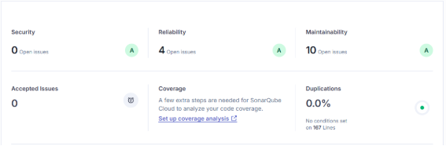

**Auditoria 2**

**Version 2**

**Versión 3**

**Tabla comparativa**

|Version|Security|Reliabilty|Maintainability|Accepted Issues|Dupications|
| :- | :- | :- | :- | :- | :- |
|V1|0|5|36|0|0%|
|V2|0|4|10|0|0%|
|V3|0|0|1|0|0%|

**Correcciones Técnicas Aplicadas:**

1. **Variables Modernas (let/const):** Se reemplazó var por let (para variables que cambian) y const (para constantes como historial), mejorando la gestión de memoria y alcance.
1. **Estandarización Numérica:**
   1. Se cambió a Number.parseInt(buffer) para un parseo más robusto.
   1. Se implementó Number.parseFloat(buffer) siguiendo estándares modernos.
1. **Validación Estricta:** Se actualizó la validación a Number.isNaN(...), que retorna true estrictamente si el valor es NaN, evitando falsos positivos.
1. **Mejora Visual:** Se ajustaron los colores en el CSS (ej. fondo #e0e0e0 con texto #000) para cumplir con los requisitos mínimos de contraste y accesibilidad.

